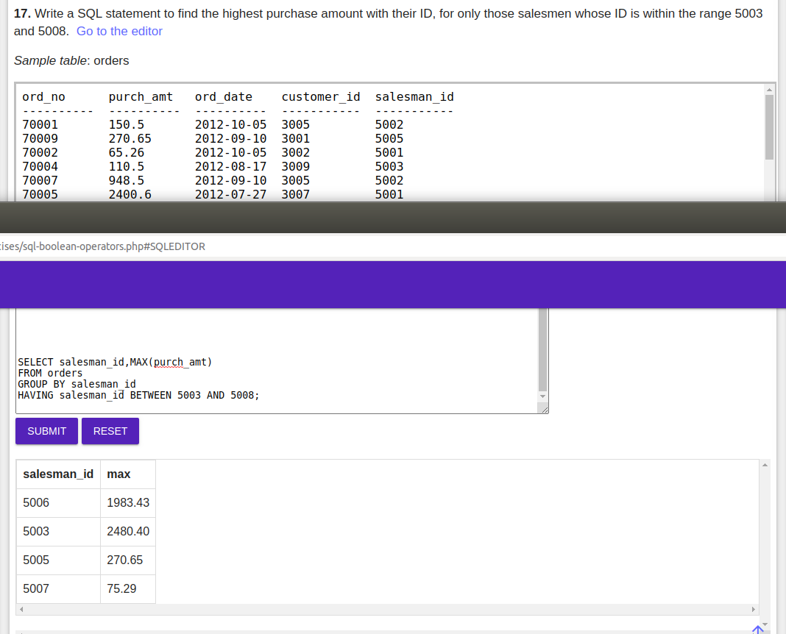

 ### 1. Write a SQL statement to find the total purchase amount of all orders.
 
 ### 2. Write a SQL statement to find the average purchase amount of all orders.
 
 ### 3. Write a SQL statement to find the number of salesmen currently listing for all of their customers.  
 
 ### 4. Write a SQL statement know how many customer have listed their names.  
 
 ### 5. Write a SQL statement find the number of customers who gets at least a gradation for his/her performance.
 
 ### 6. Write a SQL statement to get the maximum purchase amount of all the orders. 
 
 ### 7. Write a SQL statement to get the minimum purchase amount of all the orders. 
 
 ### 8. Write a SQL statement which selects the highest grade for each of the cities of the customers. 
 
 ### 9. Write a SQL statement to find the highest purchase amount ordered by the each customer with their ID and highest purchase amount
 
 ### 10. Write a SQL statement to find the highest purchase amount ordered by the each customer on a particular date with their ID, order date and highest purchase amount.
 
 ### 11. Write a SQL statement to find the highest purchase amount on a date '2012-08-17' for each salesman with their ID.
 
 ### 12. Write a SQL statement to find the highest purchase amount with their ID and order date, for only those customers who have highest purchase amount in a day is more than 2000. 
 
 ### 13. Write a SQL statement to find the highest purchase amount with their ID and order date, for those customers who have a higher purchase amount in a day is within the range 2000 and 6000. 
 
 ### 14. Write a SQL statement to find the highest purchase amount with their ID and order date, for only those customers who have a higher purchase amount in a day is within the list 2000, 3000, 5760 and 6000.
 
 ### 15. Write a SQL statement to find the highest purchase amount with their ID, for only those customers whose ID is within the range 3002 and 3007. 
 
 ### 16. Write a SQL statement to display customer details (ID and purchase amount) whose IDs are within the range 3002 and 3007 and highest purchase amount is more than 1000.
 
 ### 17. Write a SQL statement to find the highest purchase amount with their ID, for only those salesmen whose ID is within the range 5003 and 5008.
 
 ### 18. Write a SQL statement that counts all orders for a date August 17th, 2012.
 
 ### 19. Write a SQL statement that count the number of salesmen for whom a city is specified. Note that there may be spaces or no spaces in the city column if no city is specified.
 
 ### 20. Write a query that counts the number of salesmen with their order date and ID registering orders for each day.
 
 ### 21. Write a SQL query to calculate the average price of all the products.
 
 ### 22. Write a SQL query to find the number of products with a price more than or equal to Rs.350. 
 
 ### 23. Write a SQL query to display the average price of each company's products, along with their code.
 
 ### 24. Write a query in SQL to find the sum of the allotment amount of all departments. 
 
 ### 25. Write a query in SQL to find the number of employees in each department along with the department code.
 
