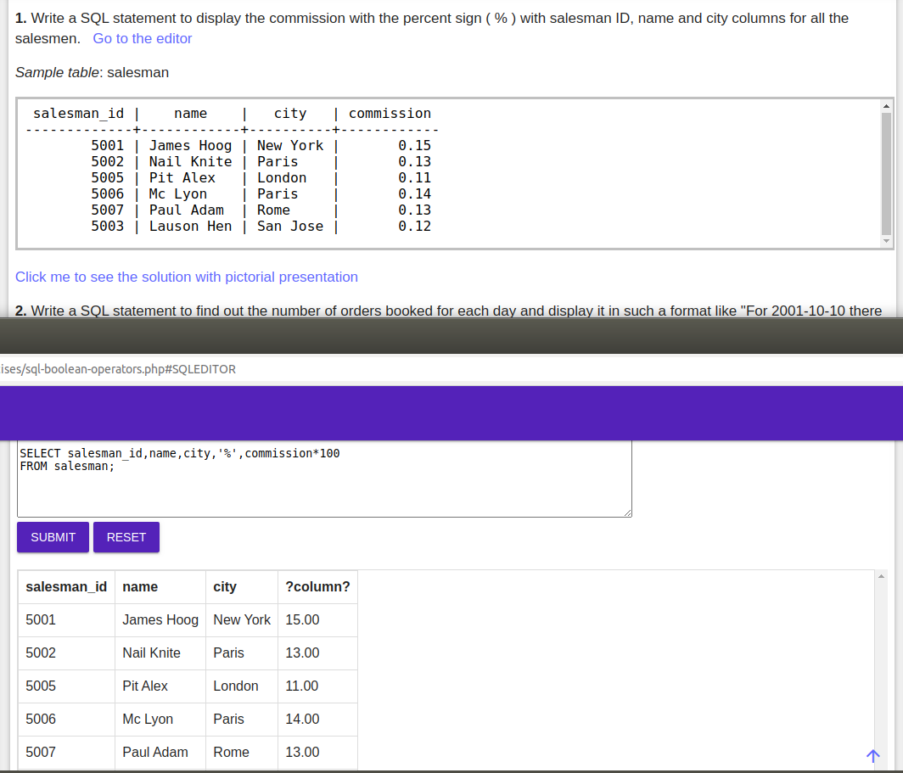
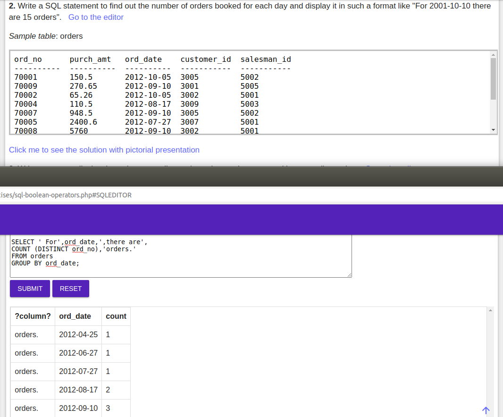
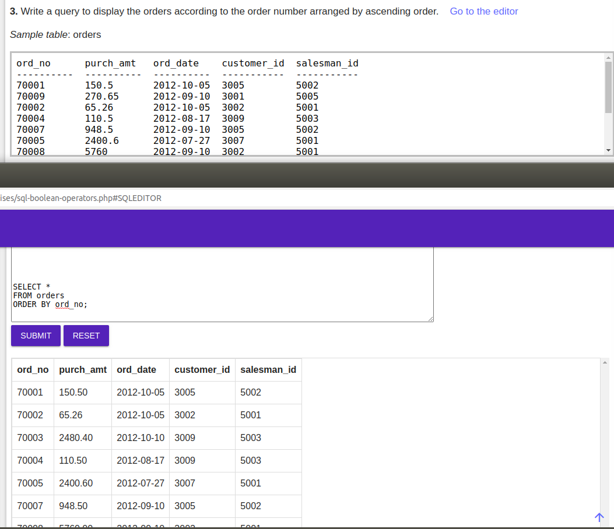
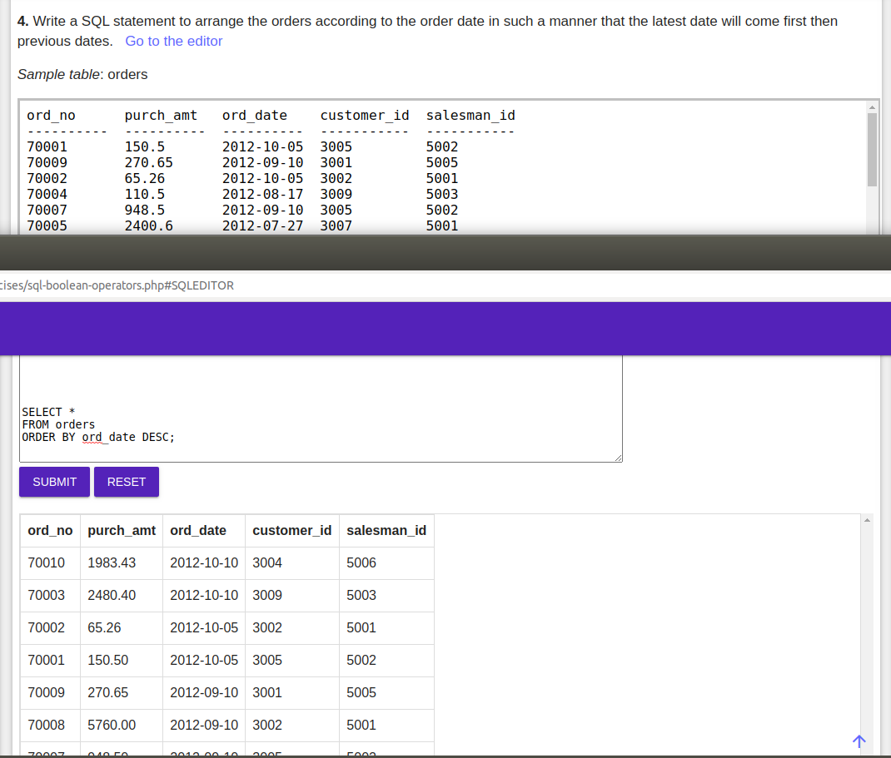
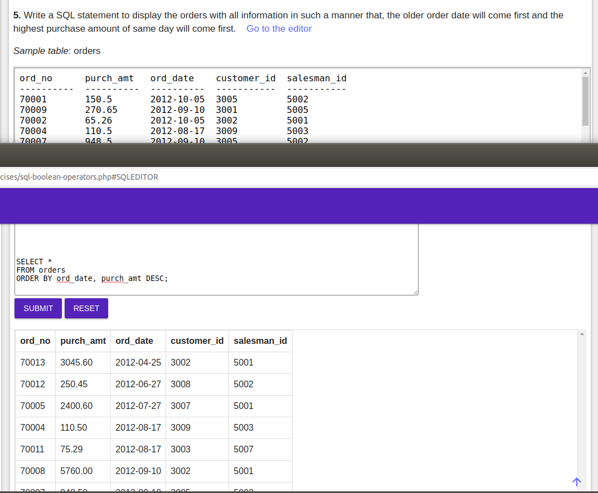
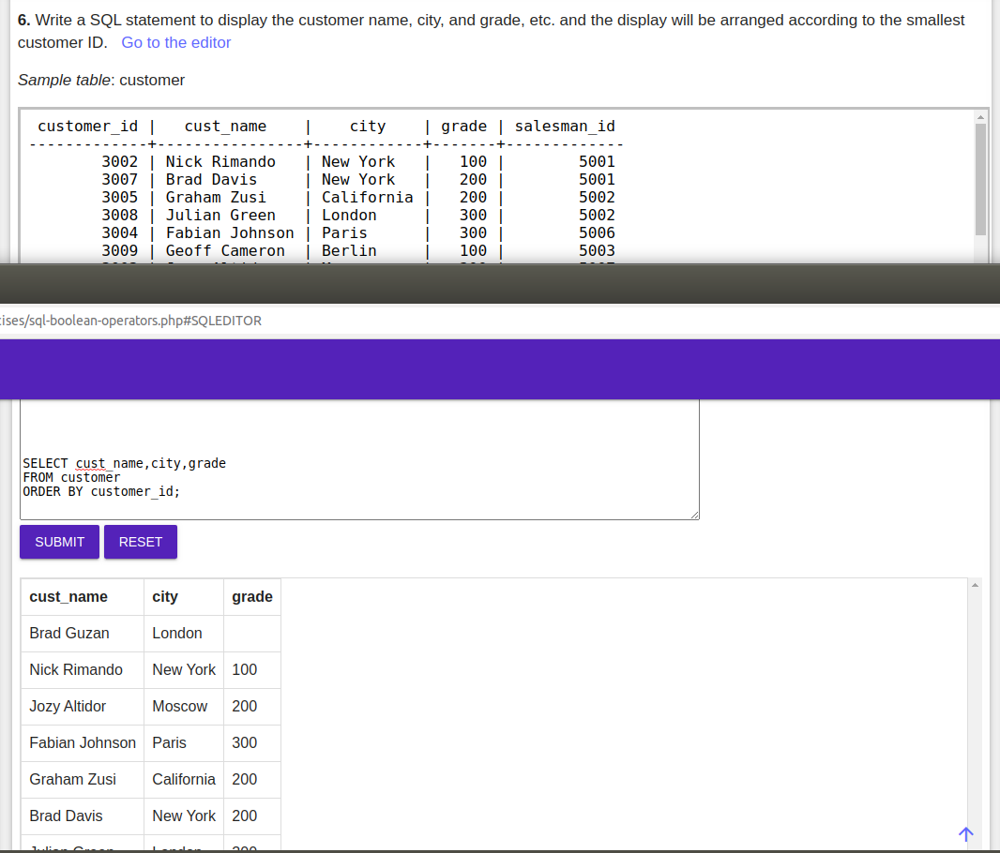
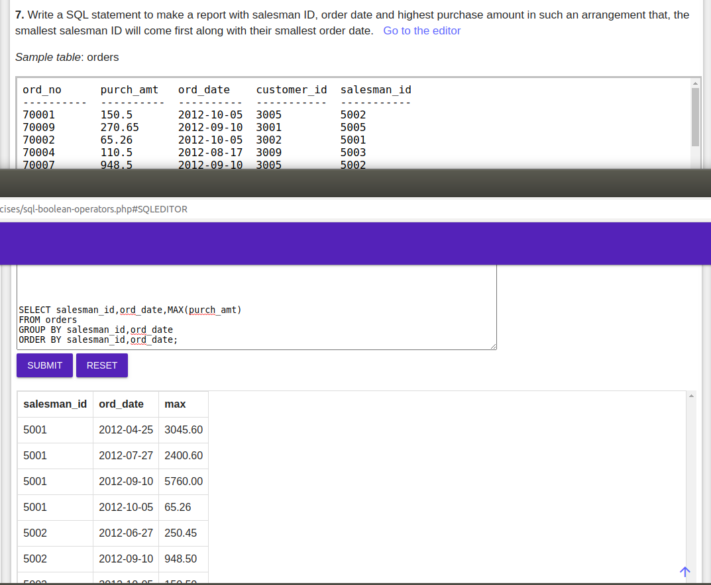
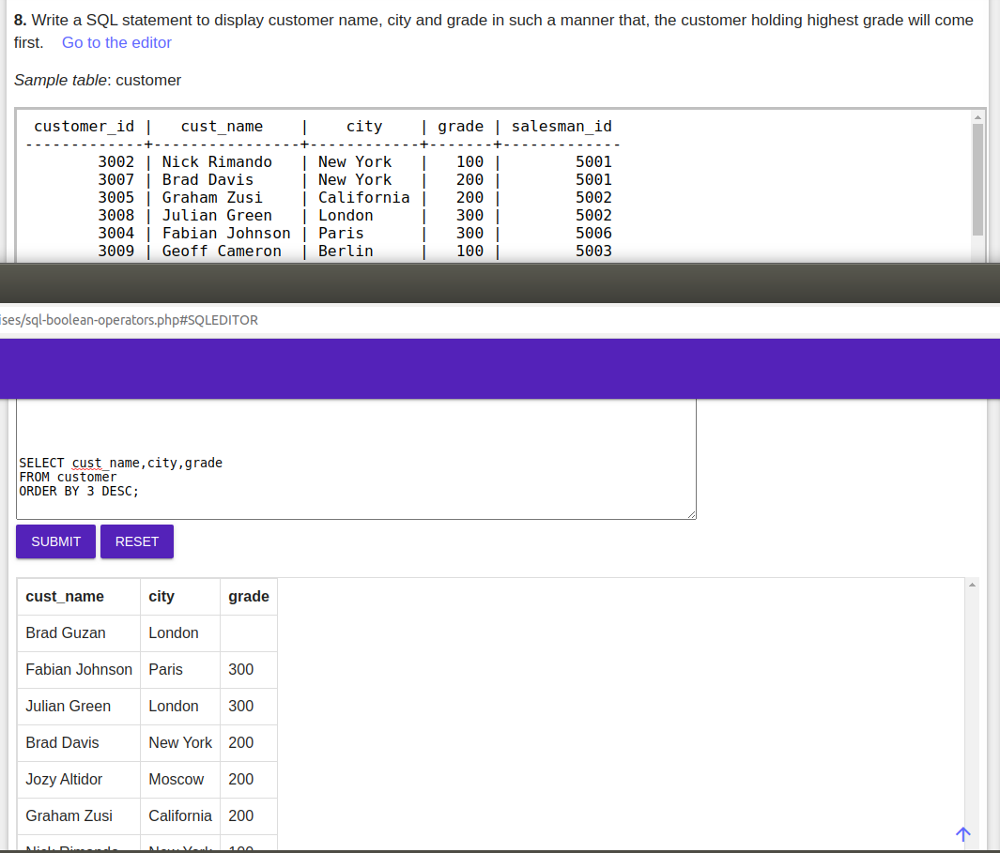
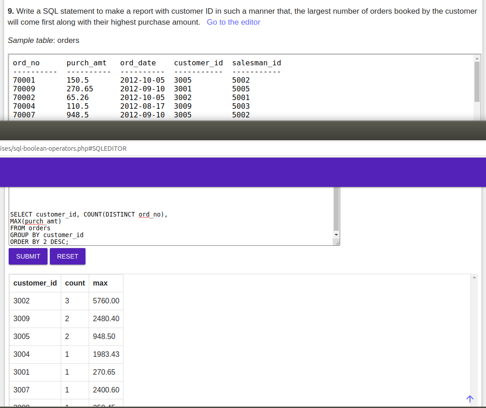
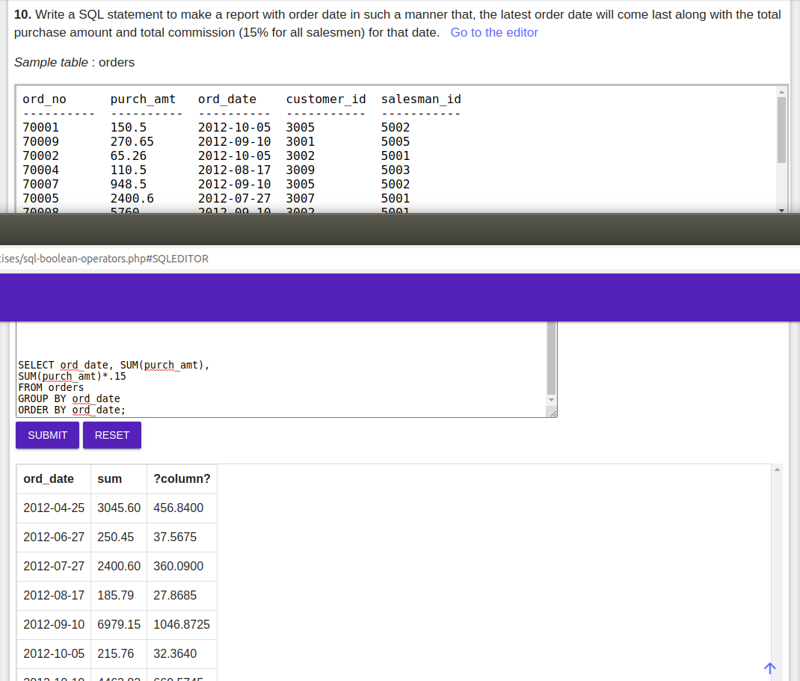

 ### 1. Write a SQL statement to display the commission with the percent sign ( % ) with salesman ID, name and city columns for all the salesmen.
 
 ### 2. Write a SQL statement to find out the number of orders booked for each day and display it in such a format like "For 2001-10-10 there are 15 orders".
 
 ### 3. Write a query to display the orders according to the order number arranged by ascending order. 
 
 ### 4. Write a SQL statement to arrange the orders according to the order date in such a manner that the latest date will come first then previous dates.
 
 ### 5. Write a SQL statement to display the orders with all information in such a manner that, the older order date will come first and the highest purchase amount of same day will come first. 
 
 ### 6. Write a SQL statement to display the customer name, city, and grade, etc. and the display will be arranged according to the smallest customer ID
 
 ### 7. Write a SQL statement to make a report with salesman ID, order date and highest purchase amount in such an arrangement that, the smallest salesman ID will come first along with their smallest order date. 
 
 ### 8. Write a SQL statement to display customer name, city and grade in such a manner that, the customer holding highest grade will come first.
 
 ### 9. Write a SQL statement to make a report with customer ID in such a manner that, the largest number of orders booked by the customer will come first along with their highest purchase amount. 
 
 ### 10. Write a SQL statement to make a report with order date in such a manner that, the latest order date will come last along with the total purchase amount and total commission (15% for all salesmen) for that date.
 
