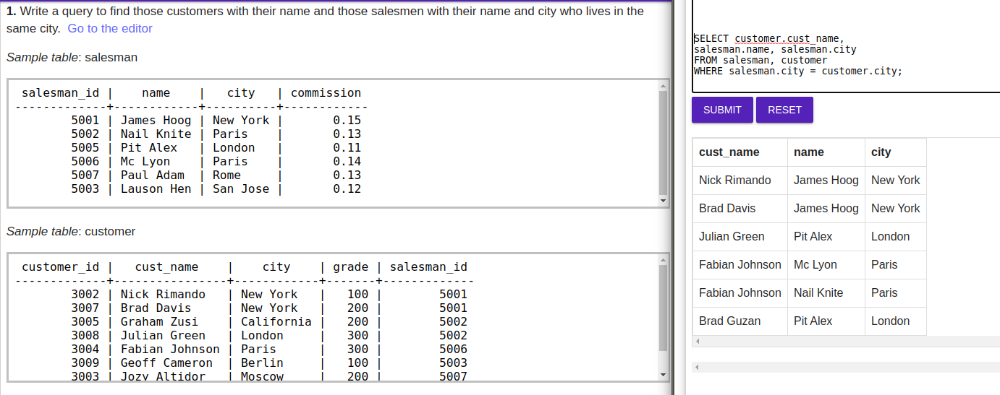
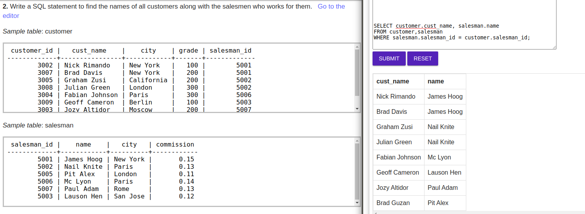
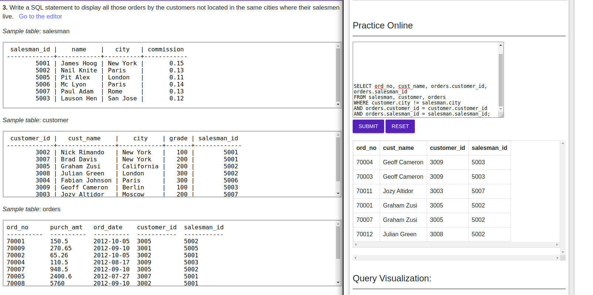
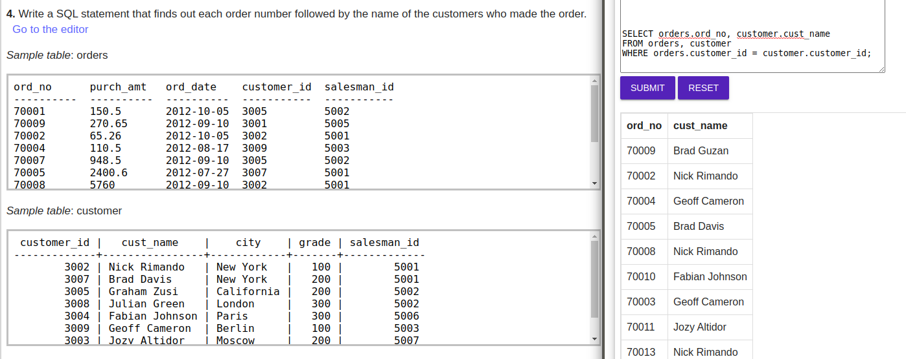
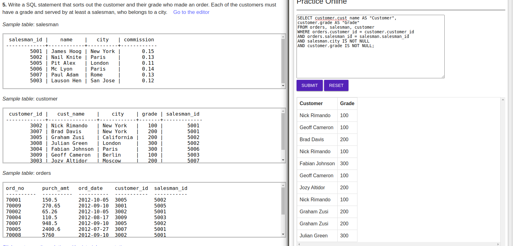
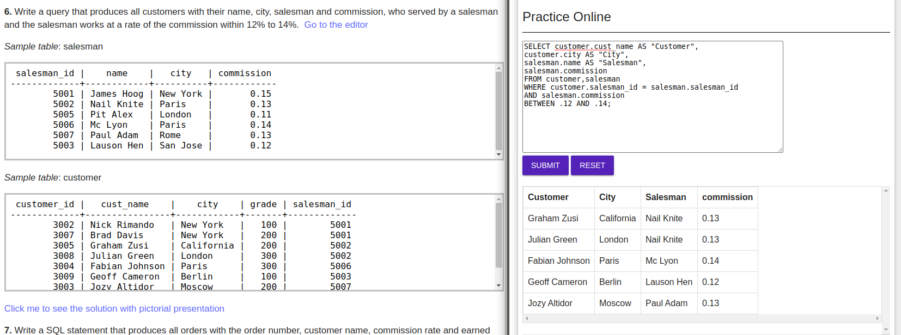
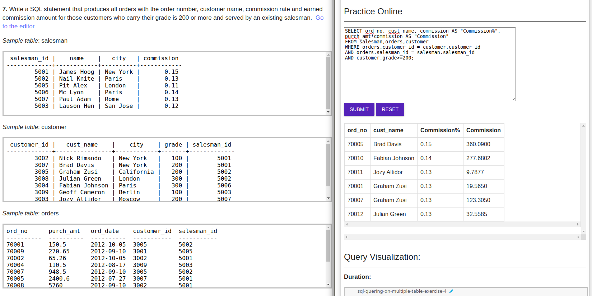
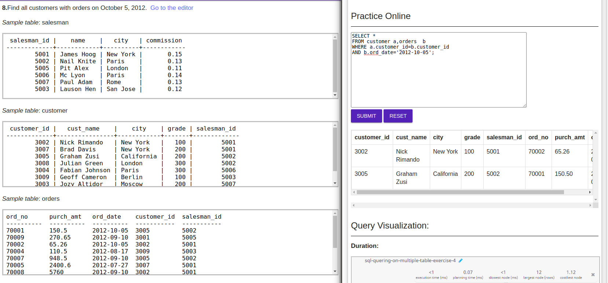

 ### 1. Write a query to find those customers with their name and those salesmen with their name and city who lives in the same city.
 
 ### 2. Write a SQL statement to find the names of all customers along with the salesmen who works for them. 
 
 ### 3. Write a SQL statement to display all those orders by the customers not located in the same cities where their salesmen live.
 
 ### 4. Write a SQL statement that finds out each order number followed by the name of the customers who made the order.  
 
 ### 5. Write a SQL statement that sorts out the customer and their grade who made an order. Each of the customers must have a grade and served by at least a salesman, who belongs to a city. 
 
 ### 6. Write a query that produces all customers with their name, city, salesman and commission, who served by a salesman and the salesman works at a rate of the commission within 12% to 14%. 
 
 ### 7. Write a SQL statement that produces all orders with the order number, customer name, commission rate and earned commission amount for those customers who carry their grade is 200 or more and served by an existing salesman.
 
 ### 8.Find all customers with orders on October 5, 2012. 
 
