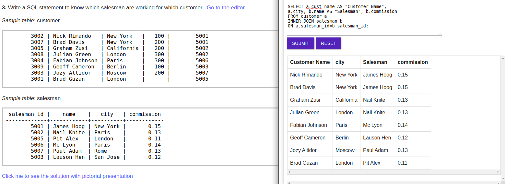
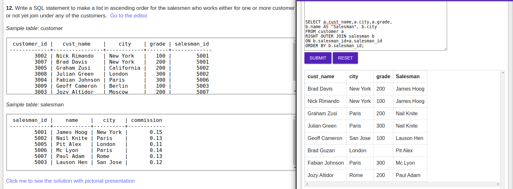

 ### 1. Write a SQL statement to prepare a list with salesman name, customer name and their cities for the salesmen and customer who belongs to the same city.
 
 ### 2. Write a SQL statement to make a list with order no, purchase amount, customer name and their cities for those orders which order amount between 500 and 2000
 
 ### 3. Write a SQL statement to know which salesman are working for which customer.
 
 ### 4. Write a SQL statement to find the list of customers who appointed a salesman for their jobs who gets a commission from the company is more than 12%.
 
 ### 5. Write a SQL statement to find the list of customers who appointed a salesman for their jobs who does not live in the same city where their customer lives, and gets a commission is above 12% . 
 
 ### 6. Write a SQL statement to find the details of a order i.e. order number, order date, amount of order, which customer gives the order and which salesman works for that customer and how much commission he gets for an order. 
 
 ### 7. Write a SQL statement to make a join on the tables salesman, customer and orders in such a form that the same column of each table will appear once and only the relational rows will come.
 
 ### 8. Write a SQL statement to make a list in ascending order for the customer who works either through a salesman or by own. 
 
 ### 9. Write a SQL statement to make a list in ascending order for the customer who holds a grade less than 300 and works either through a salesman or by own. 
 
 ### 10. Write a SQL statement to make a report with customer name, city, order number, order date, and order amount in ascending order according to the order date to find that either any of the existing customers have placed no order or placed one or more orders.
 
 ### 11. Write a SQL statement to make a report with customer name, city, order number, order date, order amount salesman name and commission to find that either any of the existing customers have placed no order or placed one or more orders by their salesman or by own
 
 ### 12. Write a SQL statement to make a list in ascending order for the salesmen who works either for one or more customer or not yet join under any of the customers.
 
 ### 13. Write a SQL statement to make a list for the salesmen who works either for one or more customer or not yet join under any of the customers who placed either one or more orders or no order to their supplier.
 
 ### 14. Write a SQL statement to make a list for the salesmen who either work for one or more customers or yet to join any of the customer. The customer may have placed, either one or more orders on or above order amount 2000 and must have a grade, or he may not have placed any order to the associated supplier.
 
 ### 15. Write a SQL statement to make a report with customer name, city, order no. order date, purchase amount for those customers from the existing list who placed one or more orders or which order(s) have been placed by the customer who is not on the list.
 
 ### 16. Write a SQL statement to make a report with customer name, city, order no. order date, purchase amount for only those customers on the list who must have a grade and placed one or more orders or which order(s) have been placed by the customer who is neither in the list not have a grade.
 
 ### 17. Write a SQL statement to make a cartesian product between salesman and customer i.e. each salesman will appear for all customer and vice versa.
 
 ### 18. Write a SQL statement to make a cartesian product between salesman and customer i.e. each salesman will appear for all customer and vice versa for that salesman who belongs to a city. 
 
 ### 19. Write a SQL statement to make a cartesian product between salesman and customer i.e. each salesman will appear for all customer and vice versa for those salesmen who belongs to a city and the customers who must have a grade.
 
 ### 20. Write a SQL statement to make a cartesian product between salesman and customer i.e. each salesman will appear for all customer and vice versa for those salesmen who must belong a city which is not the same as his customer and the customers should have an own grade.
 
 ### 21. Write a SQL query to display all the data from the item_mast, including all the data for each item's producer company.
 
 ### 22. Write a SQL query to display the item name, price, and company name of all the products.
 
 ### 23. Write a SQL query to display the average price of items of each company, showing the name of the company.
 
 ### 24. Write a SQL query to display the names of the company whose products have an average price larger than or equal to Rs. 350.
 
 ### 25. Write a SQL query to display the name of each company along with the ID and price for their most expensive product
 
 ### 26. Write a query in SQL to display all the data of employees including their department.
 
 ### 27. Write a query in SQL to display the first name and last name of each employee, along with the name and sanction amount for their department.
 
 ### 28. Write a query in SQL to find the first name and last name of employees working for departments with a budget more than Rs. 50000.
 
 ### 29. Write a query in SQL to find the names of departments where more than two employees are working. 
 