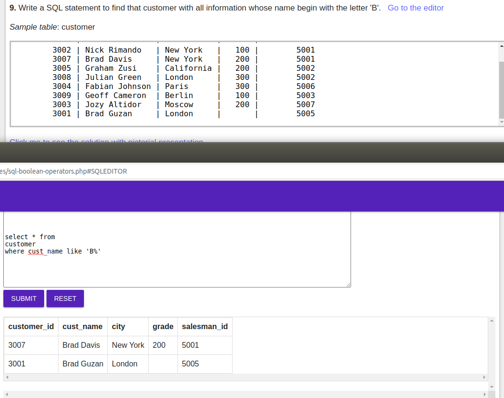

 ### 1. Write a SQL statement to find those salesmen with all information who come from the city either Paris or Rome
 
 ### 2. Write a query to filter those salesmen with all information who comes from any of the cities Paris and Rome.
 
 ### 3. Write a query to produce a list of salesman_id, name, city and commission of each salesman who live in cities other than Paris and Rome
 
 ### 4. Write a query to sort out those customers with all information whose ID value is within any of 3007, 3008 and 3009
 
 ### 5. Write a SQL statement to find those salesmen with all information who gets the commission within a range of 0.12 and 0.14.
 
 ### 6. Write a query to filter all those orders with all information which purchase amount value is within the range 500 and 4000 except those orders of purchase amount value 948.50 and 1983.43.
 
 ### 7. Write a SQL statement to find those salesmen with all other information and name started with any letter within 'A' and 'K'.
 
 ### 8. Write a SQL statement to find those salesmen with all other information and name started with other than any latter within 'A' and 'L'. 
 
 ### 9. Write a SQL statement to find that customer with all information whose name begin with the letter 'B'.
 
 ### 10. Write a SQL statement to find all those customers with all information whose names are ending with the letter 'n'.
 
 ### 11. Write a SQL statement to find those salesmen with all information whose name containing the 1st character is 'N' and the 4th character is 'l' and rests may be any character.
 
 ### 12. Write a SQL statement to find those rows from the table testtable which contain the escape character underscore ( _ ) in its column 'col1'. 
 
 ### 13. Write a SQL statement to find those rows from the table testtable which does not contain the character underscore ( _ ) in its column 'col1'. 
 
 ### 14. Write a SQL statement to find those rows from the table testtable which contain the escape character ( / ) in its column 'col1'.
 
 ### 15. Write a SQL statement to find those rows from the table testtable which does not contain the escape character ( / ) in its column 'col1'. 
 
 ### 16. Write a SQL statement to find those rows from the table testtable which contain the string ( _/ ) in its column 'col1'.
 
 ### 17. Write a SQL statement to find those rows from the table testtable which does not contain the string ( _/ ) in its column 'col1'.
 
 ### 18. Write a SQL statement to find those rows from the table testtable which contain the character ( % ) in its column 'col1'.
 
 ### 19. Write a SQL statement to find those rows from the table testtable which does not contain the character ( % ) in its column 'col1'.
 
 ### 20. Write a SQL statement to find that customer with all information who does not get any grade except NULL. 
 
 ### 21. Write a SQL statement to find that customer with all information who gets a grade except NULL value.
 
 ### 22. Write a query in SQL to display all the data of employees whose last name begins with an 'D'.
 

 