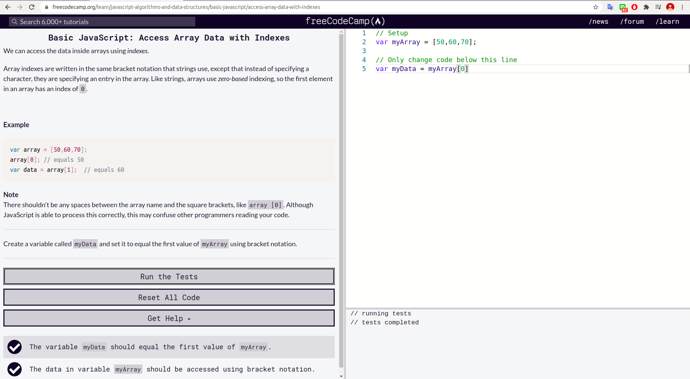
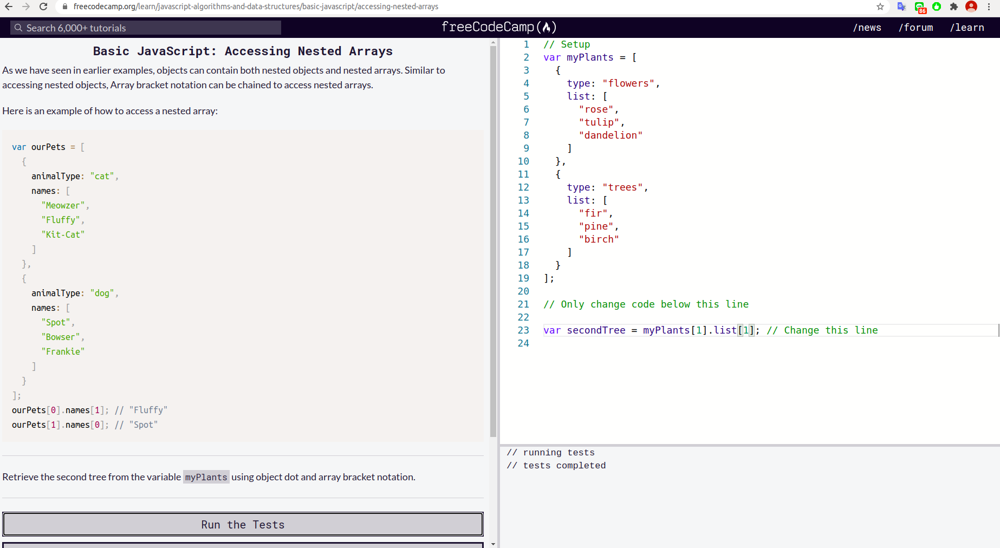
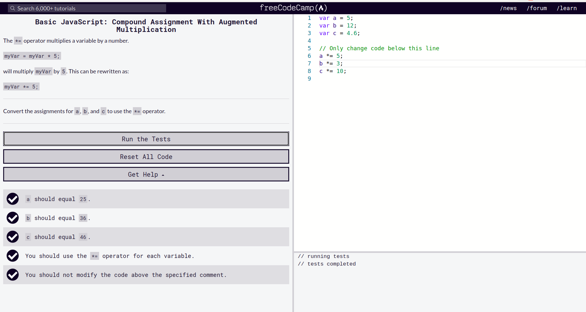

 
 

 #### Writing Code on Browser Console

 

 ```js
1 sadasd
2 sadasd
```

 
**Example: Single Line Comment**

// This is the first comment  
 // This is the second comment  
 // I am a single line comment

**Example: Multiline Comment**
- **_Inline script_**
- **_Internal script_**