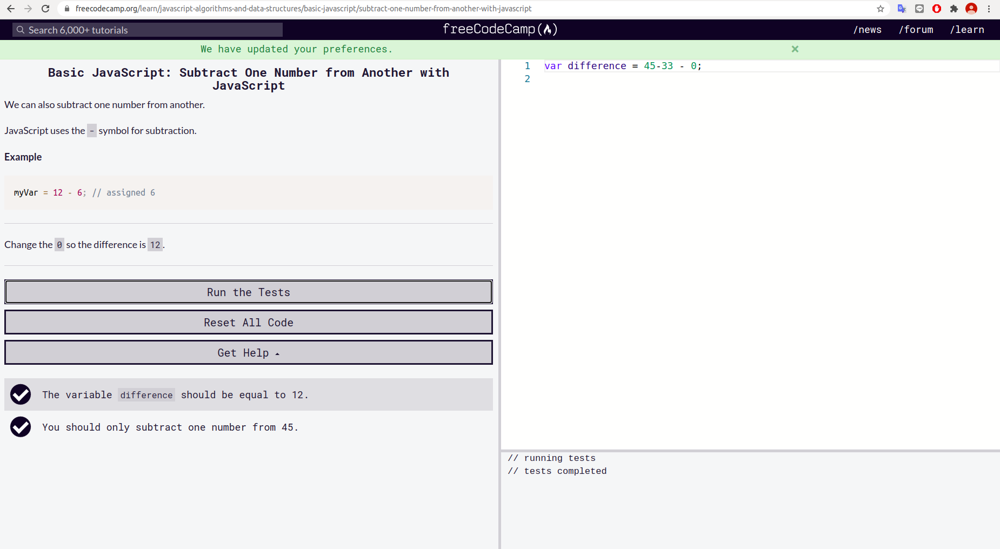
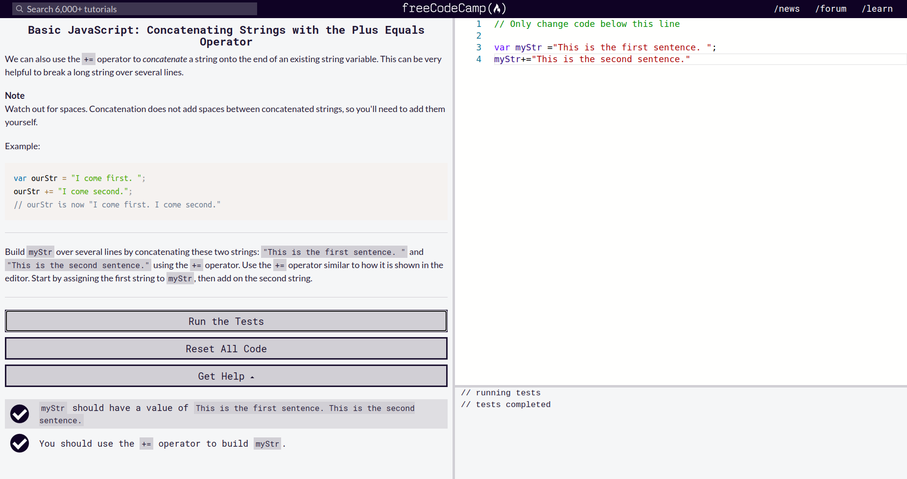
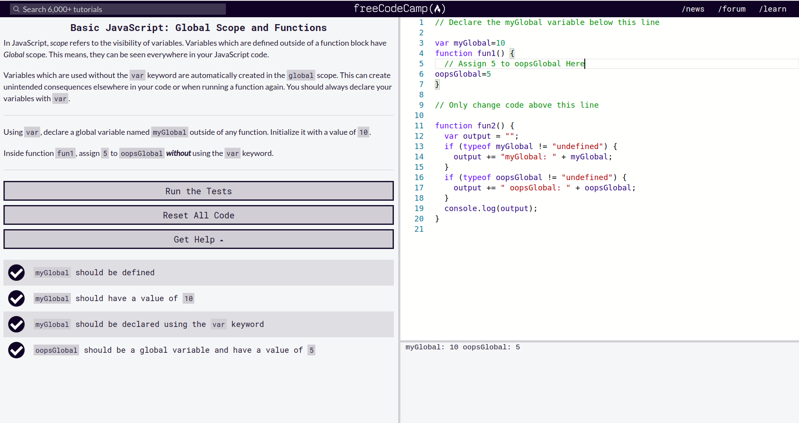
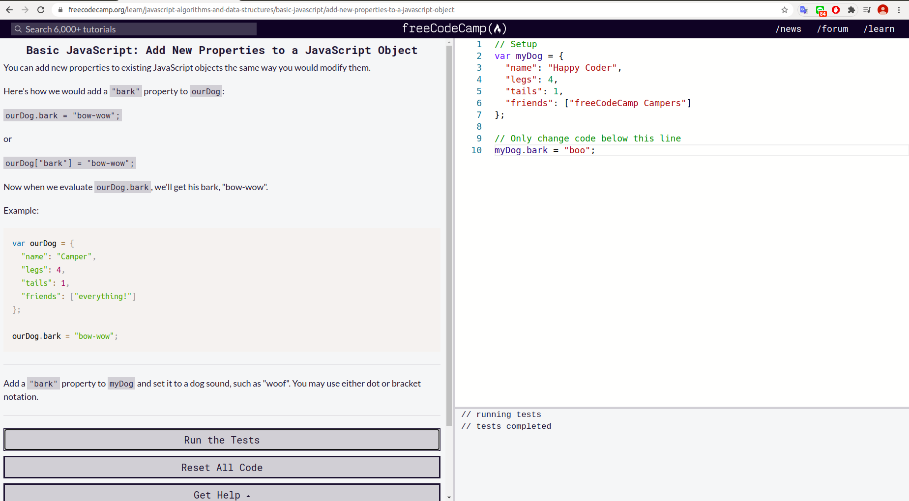

 
 

 #### Comment Your JavaScript Code

 


 #### Declare JavaScript Variables

 


### Storing Values with the Assignment Operator
 

###  Assigning the Value of One Variable to Another
 
 
### Initializing Variables with the Assignment Operator
 

### Understanding Uninitialized Variables
 

### Understanding Case Sensitivity in Variables
 

### Add Two Numbers with JavaScript
 

### Subtract One Number from Another with JavaScript
 

### Multiply Two Numbers with JavaScript
 

### Divide One Number by Another with JavaScriptPassed
 

### Increment a Number with JavaScript
 

### Decrement a Number with JavaScript
 

### Create Decimal Numbers with JavaScript
 

### Multiply Two Decimals with JavaScript
 

### Divide One Number by Another with JavaScrip
 

### Increment a Number with JavaScript
 

### Decrement a Number with JavaScript
 

### Create Decimal Numbers with JavaScript
 

### Multiply Two Decimals with JavaScript
 

### Divide One Decimal by Another with JavaScript
 

### Finding a Remainder in JavaScript
 

### Compound Assignment With Augmented Addition
 

### Compound Assignment With Augmented Subtraction
 

### Compound Assignment With Augmented Multiplication
 

### Compound Assignment With Augmented Division
 

### Declare String Variables
 

### Escaping Literal Quotes in Strings
 

### Quoting Strings with Single Quotes
 

### Escape Sequences in Strings
 

### Concatenating Strings with Plus Operator
 

### Concatenating Strings with the Plus Equals Operator
 

### Constructing Strings with Variables
 

### Appending Variables to Strings
 

### Find the Length of a String
 

### Use Bracket Notation to Find the First Character in a String
 

### Understand String Immutability
 

### Use Bracket Notation to Find the Nth Character in a String
 

### Use Bracket Notation to Find the Last Character in a String
 

### Use Bracket Notation to Find the Nth-to-Last Character in a String
 

### Word Blanks
 

### Store Multiple Values in one Variable using JavaScript Arrays
 

### Nest one Array within Another Array
 

### Access Array Data with Indexes
 

### Modify Array Data With Indexes
 

### Access Multi-Dimensional Arrays With Indexes
 

### Manipulate Arrays With push()
 .png)

### Manipulate Arrays With pop()
 .png)

### Manipulate Arrays With shift()
 .png)

### Manipulate Arrays With unshift()
 .png)

### Shopping List
 

### Write Reusable JavaScript with Functions
 

### Passing Values to Functions with Arguments
 

### Global Scope and Functions
 

### Return a Value from a Function with Return
 

### Understanding Undefined Value returned from a Function
 

### Assignment with a Returned Value
 

### Stand in Line
 

### Understanding Boolean Values
 

### Use Conditional Logic with If Statements
 

### Comparison with the Equality Operator
 

### Comparison with the Strict Equality Operator
 

### Practice comparing different values
 

###  Comparison with the Inequality Operator
 

### Comparison with the Strict Inequality Operator
 

### Comparison with the Greater Than Operator
 

### Comparison with the Greater Than Or Equal To Operator
 

### Comparison with the Less Than Operator
 

### Comparison with the Less Than Or Equal To Operator
 

### Comparisons with the Logical And Operator
 

### Introducing Else Statements
 

### Introducing Else If Statements
 

### Logical Order in If Else Statements
 

### Chaining If Else Statements
 

### Golf Code
 

### Selecting from Many Options with Switch Statements
 

### Adding a Default Option in Switch Statements
 

### Multiple Identical Options in Switch Statements
 

### Replacing If Else Chains with Switch
 

### Returning Boolean Values from Functions
 

### Return Early Pattern for Functions
 

### Counting Cards
 

### Build JavaScript Objects
 

### Accessing Object Properties with Dot Notation
 

### Accessing Object Properties with Bracket Notation
 

### Accessing Object Properties with Variables
 

### Updating Object Properties
 

### Add New Properties to a JavaScript Object
 

### Delete Properties from a JavaScript Object
 

### Using Objects for Lookups
 

### Testing Objects for Properties
 

### Manipulating Complex Objects
 

### Accessing Nested Objects
 

### Accessing Nested Arrays
 

### Record Collection
 

### Iterate with JavaScript While Loops
 

### Iterate with JavaScript For Loops
 

### Iterate Odd Numbers With a For Loop
 

### Count Backwards With a For Loop
 

### Iterate Through an Array with a For Loop
 

### Nesting For Loops
 

### Iterate with JavaScript Do...While Loops
 

### Replace Loops using Recursion
 

### Profile Lookup
 

### Generate Random Fractions with JavaScript
 

### Generate Random Whole Numbers with JavaScript
 

### Generate Random Whole Numbers within a Range
 

### Use the parseInt Function
 

### Use the parseInt Function with a Radix
 

### Use the Conditional (Ternary) Operator
 Operator.png)

### Use Multiple Conditional (Ternary) Operators
 Operators.png)

### Use Recursion to Create a Countdown
 

### Use Recursion to Create a Range of Numbers
 

  ```js
1 sadasd
2 sadasd
```
**Example: Single Line Comment**

// This is the first comment  
 // This is the second comment  
 // I am a single line comment

**Example: Multiline Comment**
- **_Inline script_**
- **_Internal script_**