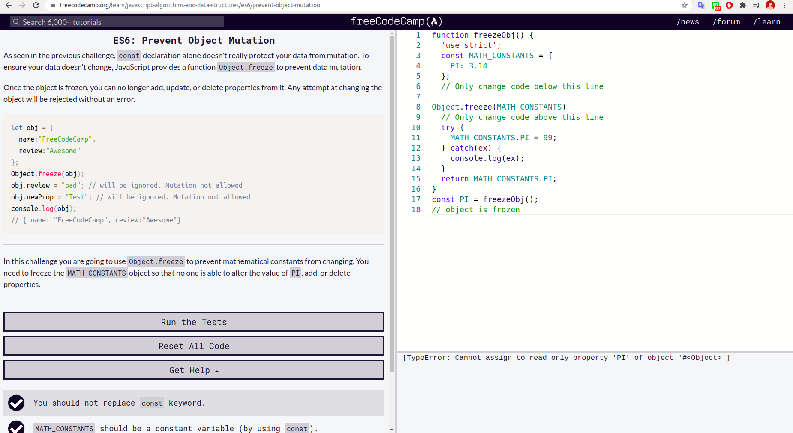
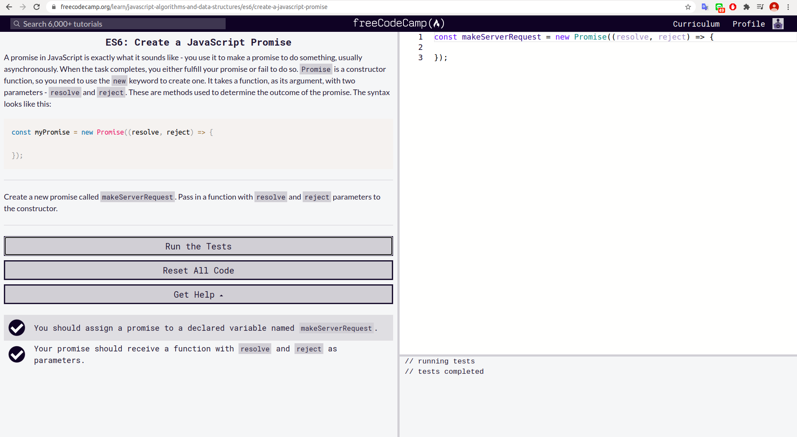

### Explore Differences Between the var and let KeywordsPassed
 
### Compare Scopes of the var and let Keywords
 
### Declare a Read-Only Variable with the const Keyword
 
### Mutate an Array Declared with const
 
### Prevent Object Mutation
 
### Use Arrow Functions to Write Concise Anonymous Functions

### Write Arrow Functions with Parameters

### Set Default Parameters for Your Functions

### Use the Rest Parameter with Function ParametersPassed

### Use the Spread Operator to Evaluate Arrays In-Place

### Use Destructuring Assignment to Extract Values from Objects

### Use Destructuring Assignment to Assign Variables from Nested Objects

### Use Destructuring Assignment to Assign Variables from Arrays

### Use Destructuring Assignment with the Rest Parameter to Reassign Array Elements

### Use Destructuring Assignment to Pass an Object as a Function's Parameters

### Create Strings using Template LiteralsPassed

### Write Concise Object Literal Declarations Using Object Property ShorthandPassed

### Write Concise Declarative Functions with ES6

### Create a Module Script

### Use export to Share a Code BlockPassed

### Reuse JavaScript Code Using import

### Use * to Import Everything from a File

### Create an Export Fallback with export default

### Import a Default Export

### Create a JavaScript Promise

### Complete a Promise with resolve and reject

### Handle a Fulfilled Promise with then

### Handle a Rejected Promise with catch

