### Use the JavaScript Console to Check the Value of a Variable
 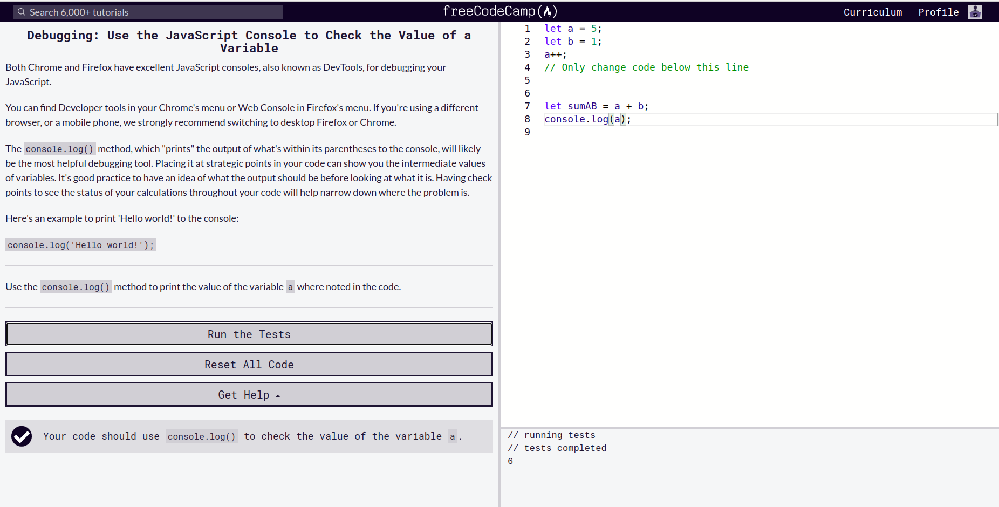
### Understanding the Differences between the freeCodeCamp and Browser Console
 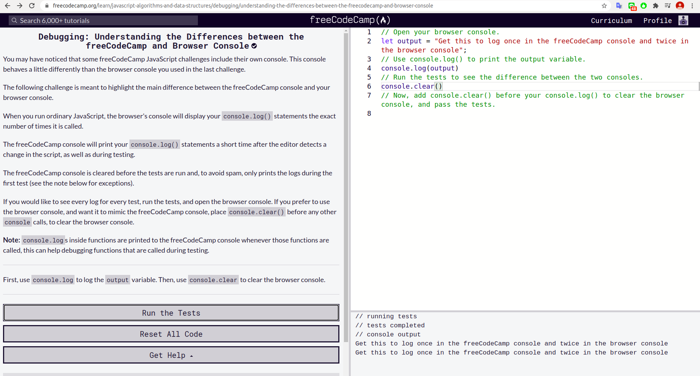
### Use typeof to Check the Type of a VariablePassed
 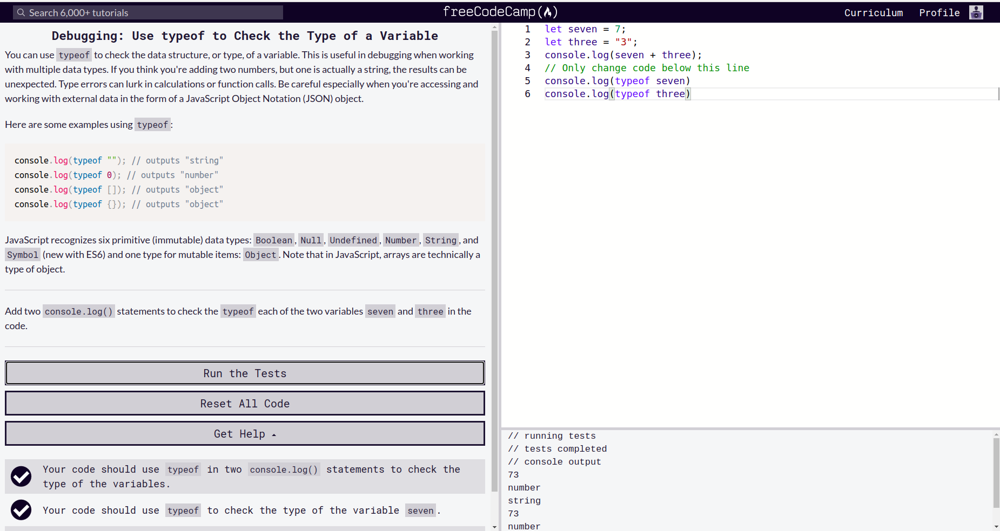
### Catch Misspelled Variable and Function Names
 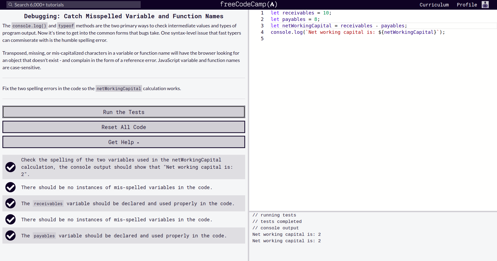
### Catch Unclosed Parentheses, Brackets, Braces and Quotes
 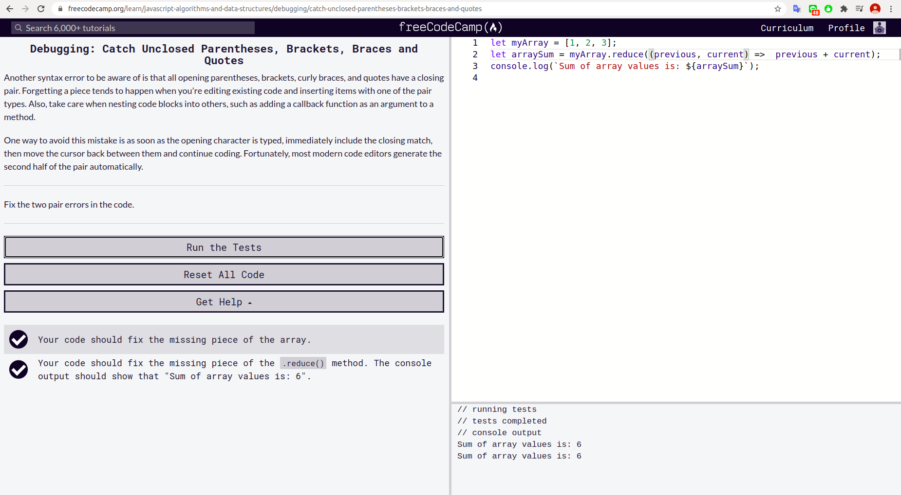
### Catch Mixed Usage of Single and Double Quotes
 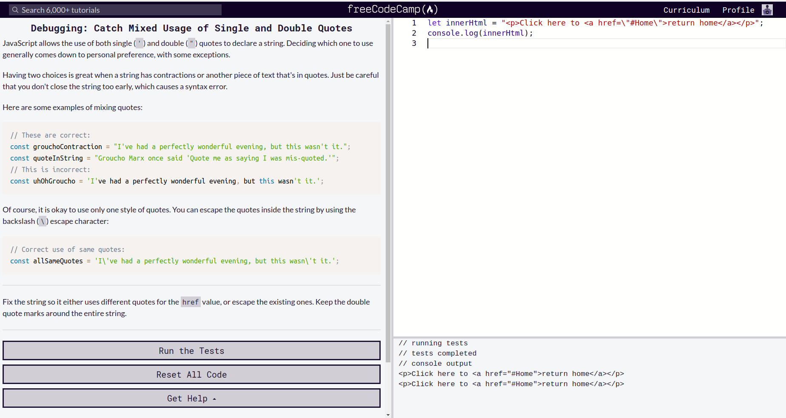
### Catch Use of Assignment Operator Instead of Equality Operator
 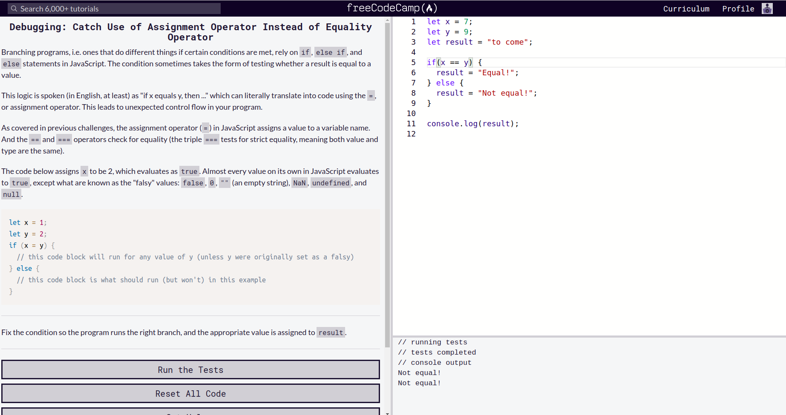
### Catch Missing Open and Closing Parenthesis After a Function Call
 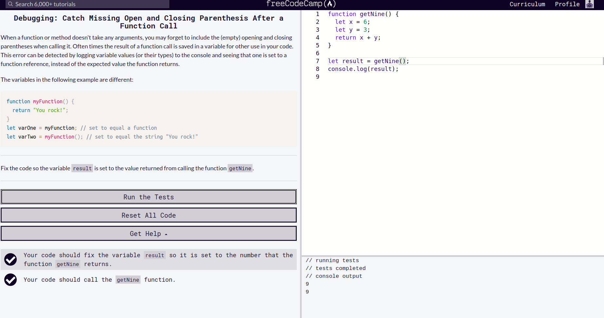
### Catch Arguments Passed in the Wrong Order When Calling a Function
 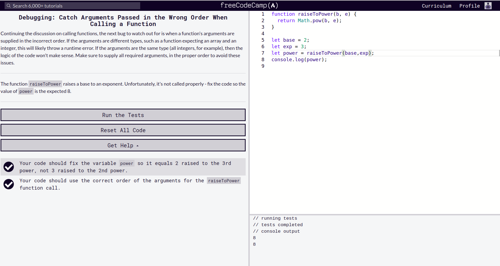
### Catch Off By One Errors When Using Indexing
 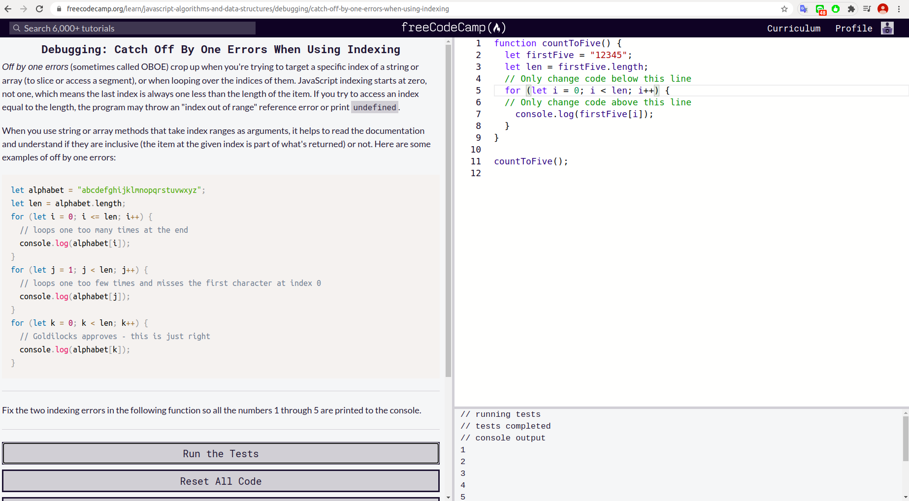
### Use Caution When Reinitializing Variables Inside a Loop
 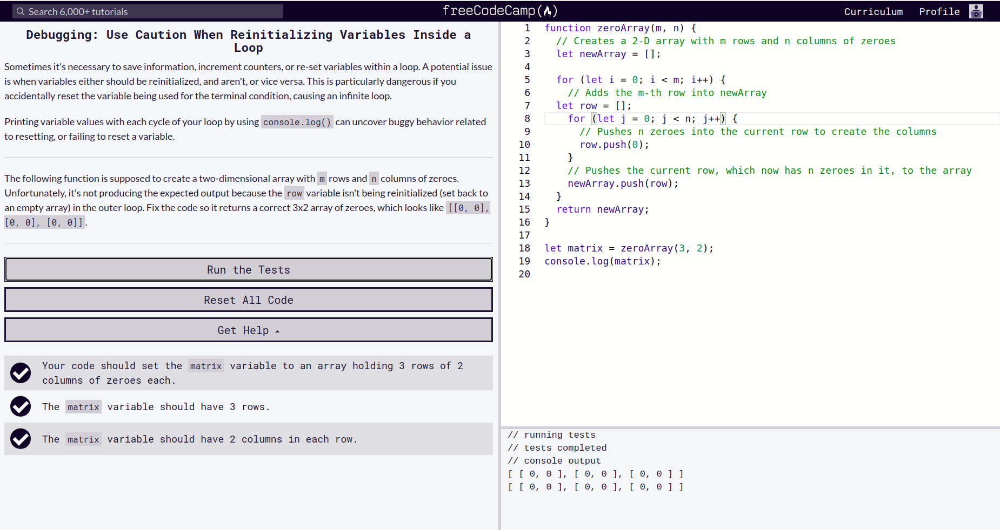
### Prevent Infinite Loops with a Valid Terminal ConditionPassed
 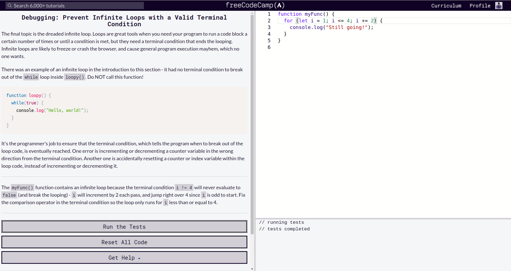
