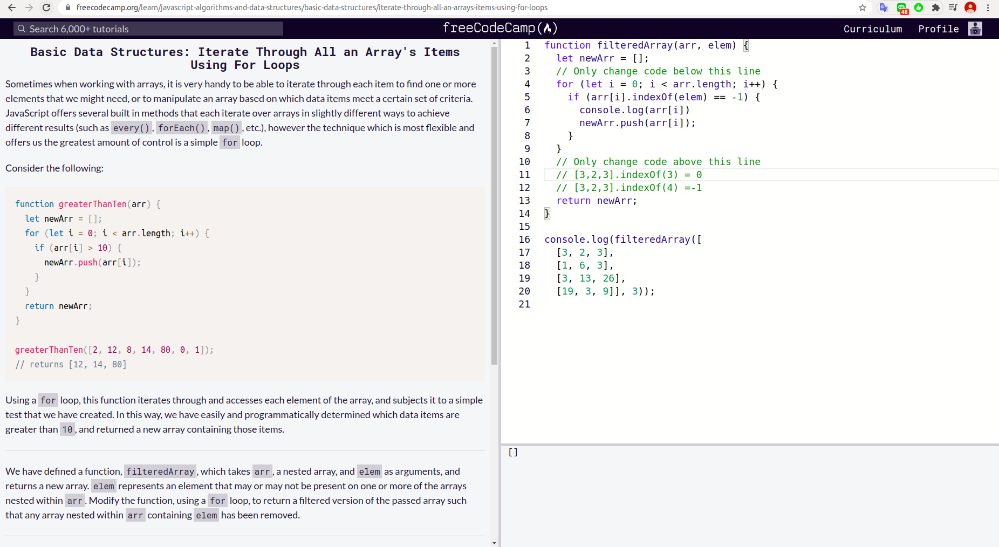

### Use an Array to Store a Collection of Data
 
### Access an Array's Contents Using Bracket Notation
 
### Add Items to an Array with push() and unshift()
 -and-unshift().png)
### Remove Items from an Array with pop() and shift()
 andshift().png)
### Remove Items Using splice()
 .png)
### Add Items Using splice()Passed
 .png)
### Copy Array Items Using slice()
 .png)
### Copy an Array with the Spread OperatorPassed
 
### Combine Arrays with the Spread Operator
 
### Check For The Presence of an Element With indexOf()
 .png)
### Iterate Through All an Array's Items Using For Loops
 
### Add Key-Value Pairs to JavaScript Objects
 
### Modify an Object Nested Within an Object
 
### Access Property Names with Bracket Notation
 
### Use the delete Keyword to Remove Object Properties
 
### Check if an Object has a Property
 
### Iterate Through the Keys of an Object with a for...in Statement
 
### Generate an Array of All Object Keys with Object.keys()
 .png)
### Modify an Array Stored in an Object
 
