### Convert Celsius to Fahrenheit
 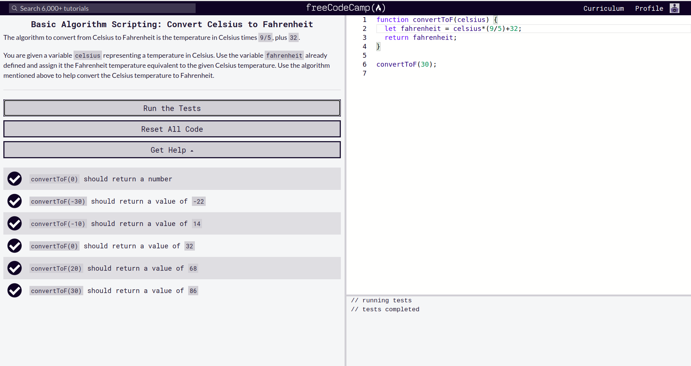
### Reverse a StringPassed
 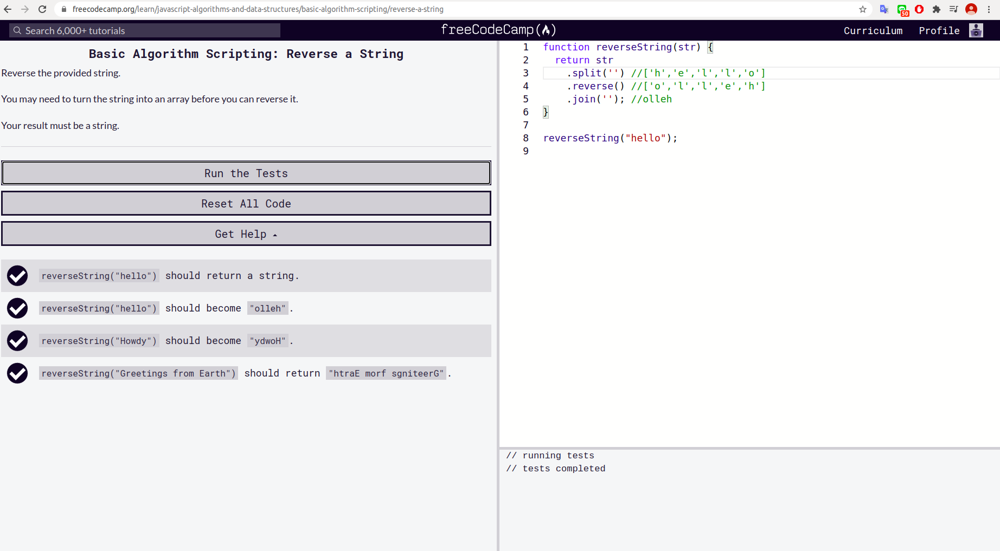
### Factorialize a NumberPassed
 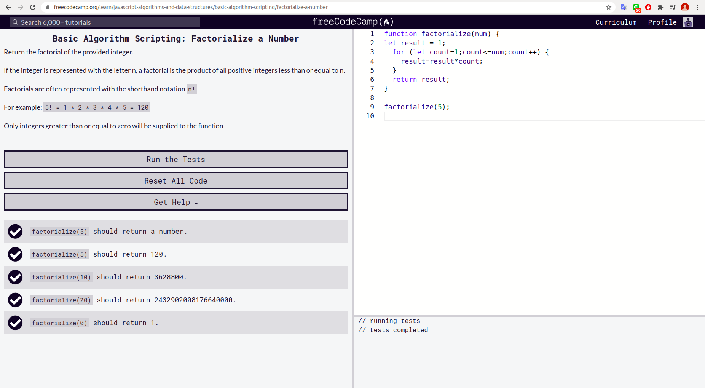
### Find the Longest Word in a String
 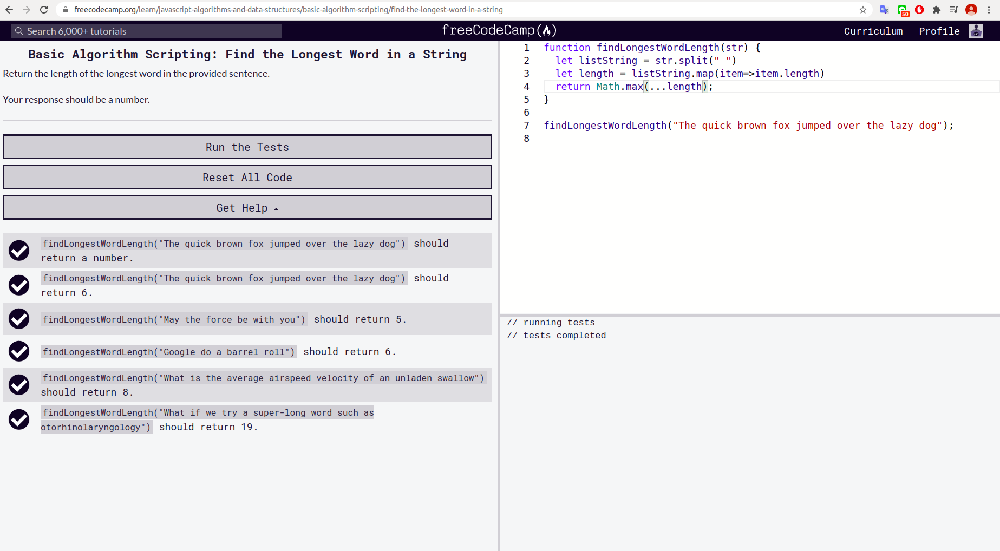
### Return Largest Numbers in Arrays
 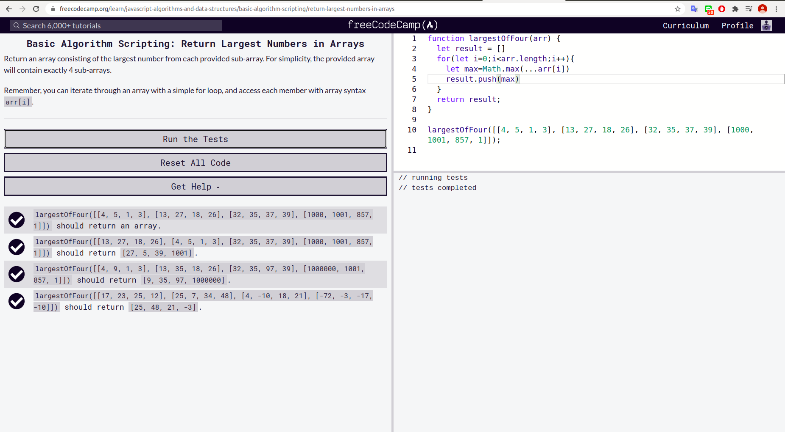
### Confirm the EndingPassed
 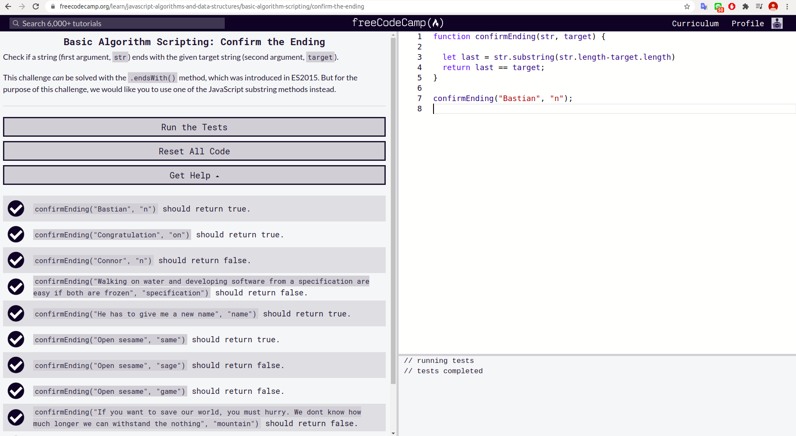
### Repeat a String Repeat a String
 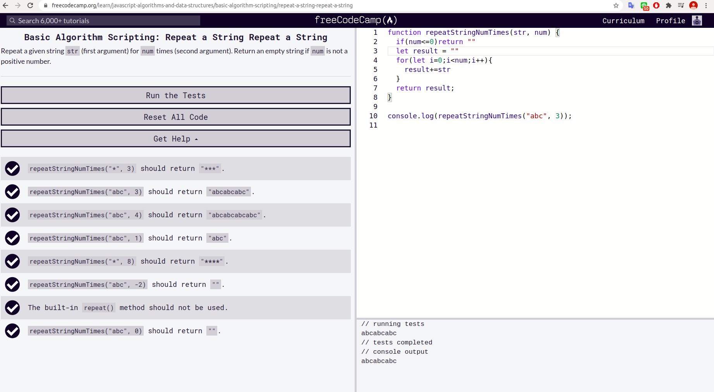
### Truncate a String
 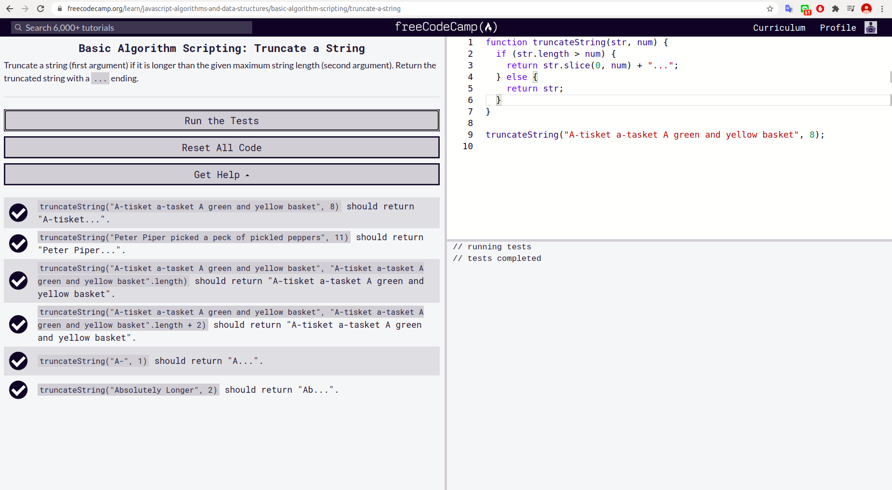
### Finders KeepersPassed
 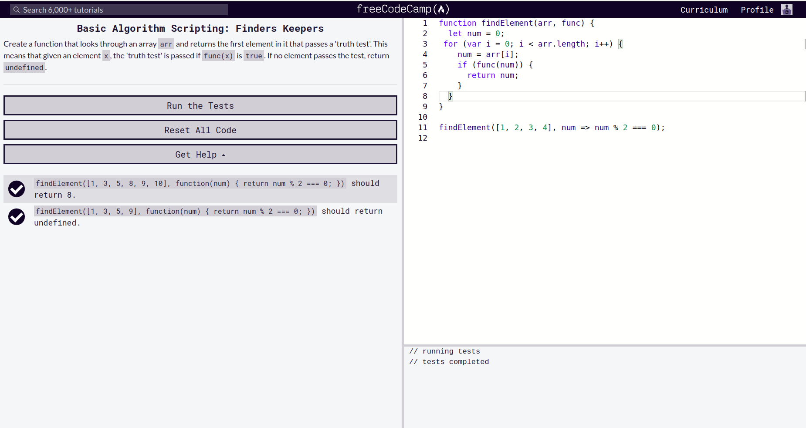
### Boo who
 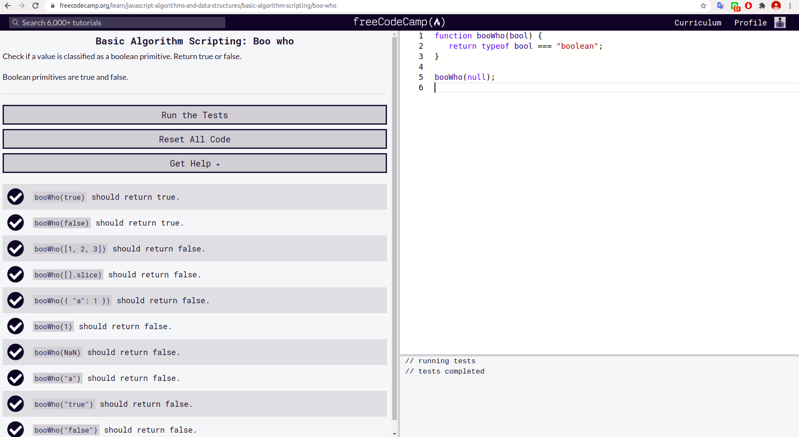
### Title Case a Sentence
 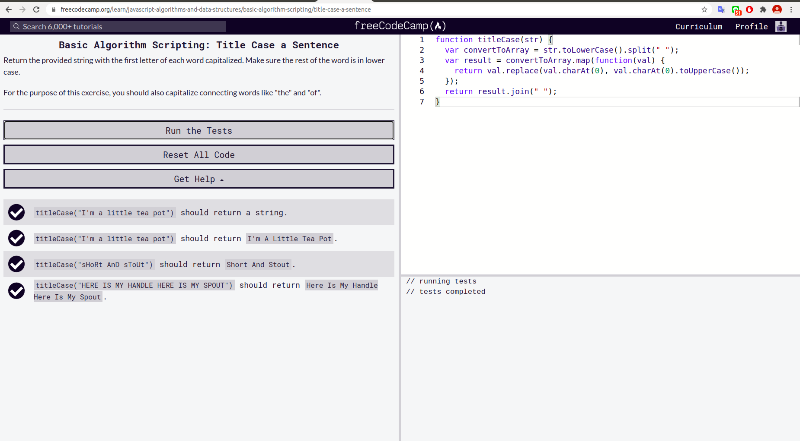
### Slice and Splice
 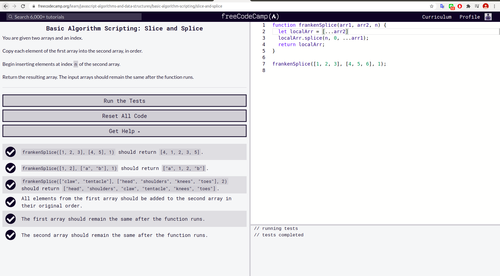
### Falsy Bouncer
 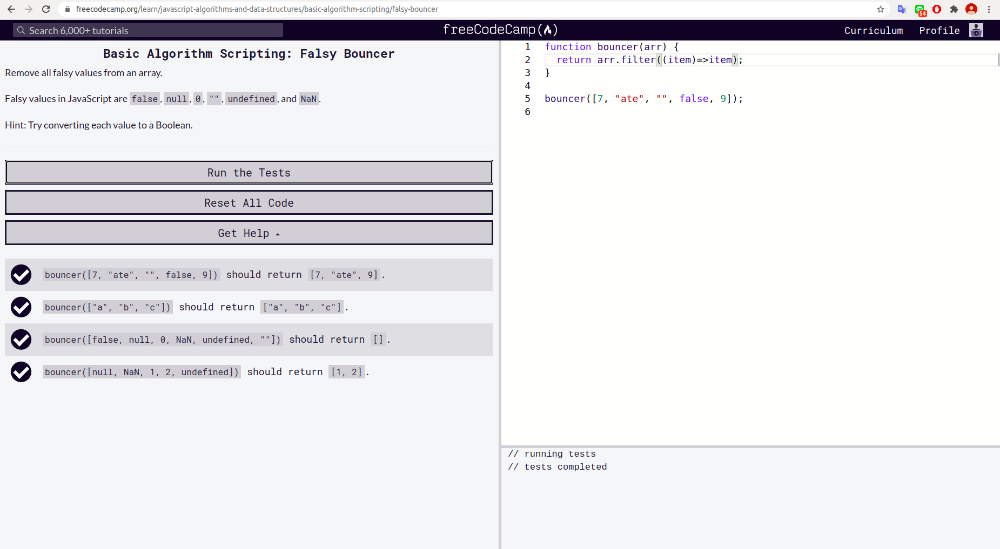
### Where do I BelongPassed
 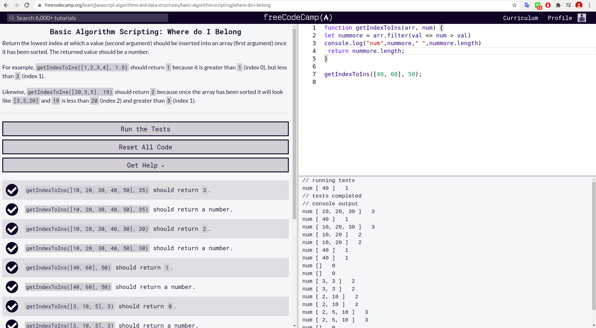
### Mutations
 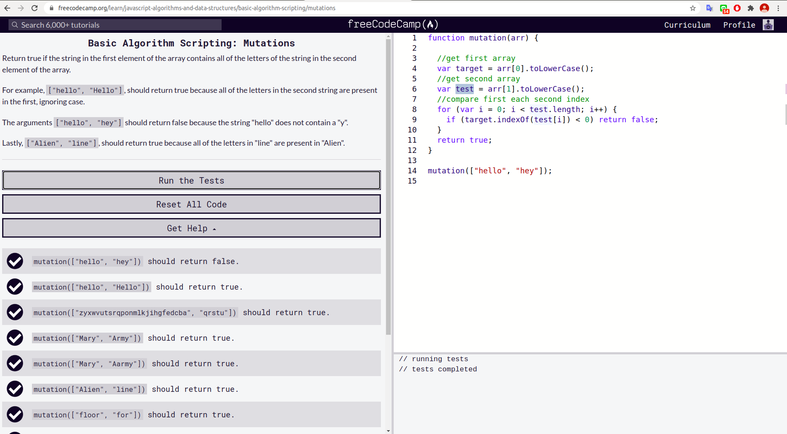
### Chunky MonkeyPassed
 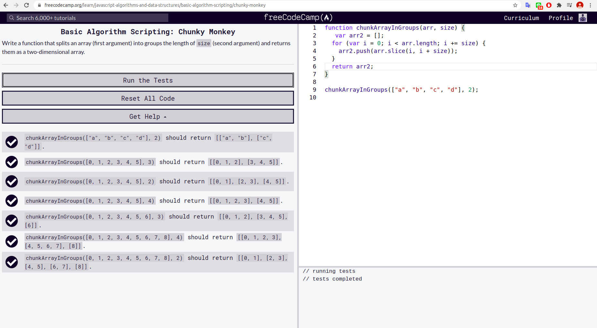
