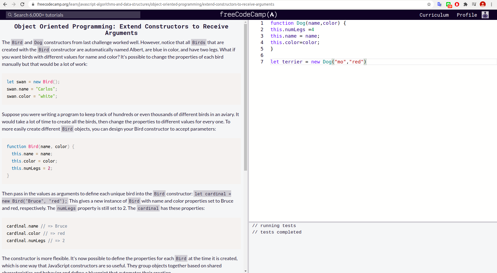
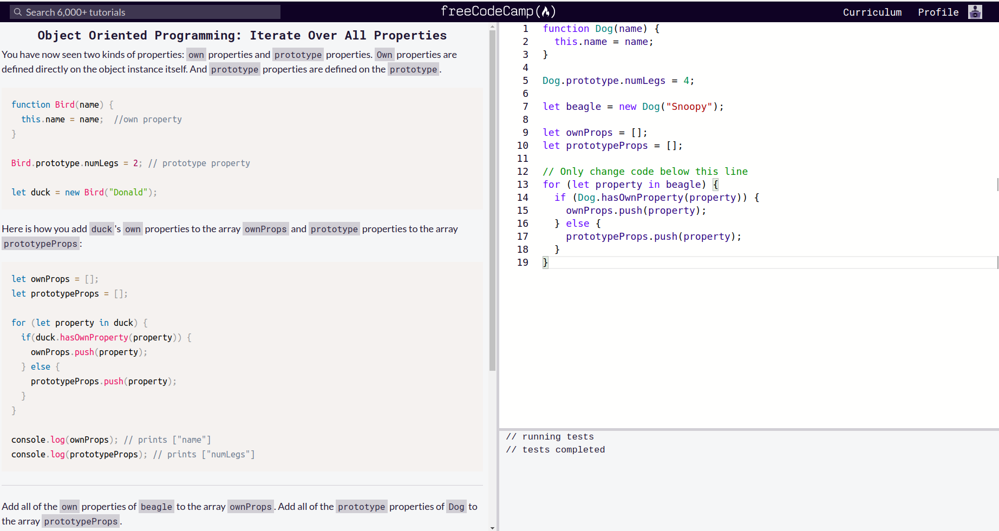
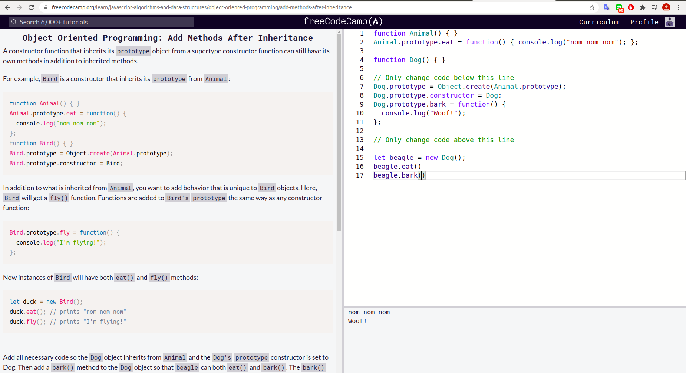

### Create a Basic JavaScript ObjectPassed
 
### Use Dot Notation to Access the Properties of an Object
 
### Create a Method on an Object
 
### Make Code More Reusable with the this KeywordPassed
 
### Define a Constructor Function
 
### Use a Constructor to Create Objects
 
### Extend Constructors to Receive Arguments
 
### Verify an Object's Constructor with instanceof
 
### Understand Own Properties
 
### Use Prototype Properties to Reduce Duplicate Code
 
### Iterate Over All Properties
 
### Understand the Constructor Property
 
### Change the Prototype to a New Object
 
### Remember to Set the Constructor Property when Changing the Prototype
 
### Understand Where an Object’s Prototype Comes From
 
###  Understand the Prototype ChainPassed
 
### Use Inheritance So You Don't Repeat Yourself
 
### Inherit Behaviors from a Supertype
 
### Set the Child's Prototype to an Instance of the Parent
 
### Reset an Inherited Constructor Property
 
### Add Methods After InheritancePassed
 
### Override Inherited Methods
 
### Use a Mixin to Add Common Behavior Between Unrelated Objects
 
### Use Closure to Protect Properties Within an Object from Being Modified Externally
 
### Understand the Immediately Invoked Function Expression (IIFE)
 .png)
### Use an IIFE to Create a Module
 
